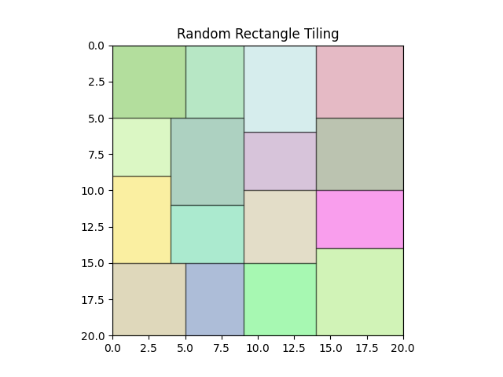

# RandTiling
  
本项目随机地将一个正方形（或长方形）区域拆分成若干行，每行再拆分若干随机宽度的小矩形块，并通过 **Matplotlib** 进行可视化展示。

## 特性

1. **随机拆分**  
   - 使用自定义的算法，将一条长度 `N` 的区间拆分成 `m` 行，每行随机分成若干子区间，保证每块宽度（或高度）在 `[lb, ub]` 范围内。

2. **灵活控制**  
   - 可以通过修改 `lb`（下界）和 `ub`（上界）来调整每块矩形的最小/最大宽高。  
   - 代码中提供了一些断言，以避免无法满足约束时陷入错误拆分。

3. **可视化**  
   - 最终使用 **Matplotlib** 绘制所有随机拆分的结果，并在图中显示每个随机矩形块。


## 快速开始
1. **克隆或下载此项目**
   ```bash
    git clone https://github.com/shioko-chan/RandTiling.git
    cd RandTiling
   ```
2. **安装依赖**
   ```bash
    python -m venv venv
    source venv/bin/activate  # Linux/macOS
    # 或 venv\Scripts\activate  # Windows

    pip install -r requirements.txt
   ```
3. **运行示例**
   ```bash
    python randtiling.py
   ```

## 代码结构

- **`Block` 类**  
  用于描述最终绘制的矩形块，包含坐标 `(x, y)` 和宽高 `(w, h)`。

- **`Ceil` 类**  
  用于描述可拆分区间 `[start, end]` 与对应的 `height`。  
  - `split(length)`: 拆分出指定长度的区间，并更新自身余量  
  - `merge(other)`: 将相邻区间合并  
  - `as_block(bottom_height)`: 将区间转换为一个 `Block` 以便绘制

- **`split_ceil(...)`**  
  将一段长度 `length` 按 `[lb, ub]` 范围随机拆分成 `target_cnt` 份，返回每份的长度列表。

- **`place_row(...)`**  
  在给定的可拆分区间 `ceils` 上，根据行数、每块宽/高的上下界 `lb, ub`，以及需要拆分的块数 `cnt`，随机生成拆分后的 `Block` 列表和新的剩余区间。

- **`solve(N, m, lb, ub)`**  
  主入口函数：从 x=0 到 x=(N-1) 的区间开始，一共拆分 `m` 行，并调用 `place_row` 分块，最终返回所有 `Block` 的列表。

- **`plot_solution(N, block)`**  
  使用 Matplotlib 绘图，将拆分得到的矩形块在一个 `N x N` 的坐标系中呈现。

## 复杂度分析

### 1. `split_ceil(lb, ub, target_cnt, length)`

- 该函数用于将长度 `length` 按 `[lb, ub]` 范围随机拆分成 `target_cnt` 份。
- 主要时间复杂度来源于：
  - `while` 循环中每次分配剩余长度 `leftover`。
  - 每次分配时构造候选索引的循环 `candidates = [i for i, x in enumerate(ans) if x < ub]`。

设 `tc` 为要拆分的段数，`length` 为总长度：
- 最坏情况下，每次只增加一个单位，循环次数与 `length` 成正比。
- 单次循环中构造候选索引需要 $O(\text{tc})$。

总复杂度近似为：
$$O(\text{length} \cdot \text{tc})$$

---

### 2. `place_row(H, lb, ub, cnt, row_cnt, row_id, ceils)`

- 该函数在给定的区间 `ceils` 上拆分矩形块并生成新的区间。
- 时间复杂度主要来自以下部分：
  1. 遍历 `ceils`，计算每段的上下界、拆分次数。假设 `ceils` 数量为 $k$，则该部分复杂度为 $O(k)$。
  2. 对每个区间调用 `split_ceil` 进行拆分，假设总长度为 $L$，块数为 $\text{cnt}$，则总复杂度为 $O(L \cdot \text{cnt})$。
  3. 排序拆分结果 `splitted_ceils.sort(...)`，复杂度为 $O(k \log k)$。
  4. 合并矩形块，复杂度为 $O(k)$。

综合考虑：
$$O(L \cdot \text{cnt} + k \log k)$$

---

### 3. `solve(N, m, lb, ub)`

- 主函数将一个大小为 $(N \times N)$ 的正方形区域拆分成 $m$ 行。
- 时间复杂度来源于 `place_row` 函数的调用：
  - `place_row` 被调用 $m$ 次，每次拆分的区间长度最多为 $N$，且需要拆分 $m$ 个块。
- 假设每行的区间数 $k$ 近似为 $m$：
  - 单次调用 `place_row` 的复杂度为 $O(N \cdot m + m \log m)$。
  - 总复杂度为：
$$O(m \cdot (N \cdot m + m \log m)) = O(m^2 N + m^2 \log m)$$


## 常见问题

1. **为什么绘图很慢？**
   - 如果 N 和 m 取值都很大，导致生成的块数非常多，Matplotlib 绘制大量矩形补丁会较耗时。可以注释掉部分绘图代码或只绘制小规模场景。

## 贡献与许可

- 本项目由 [shioko-chan](https://github.com/shioko-chan) 创建并维护，欢迎提交 issue 和 pull request。  

- 本项目采用 [GNU Affero General Public License v3.0](https://www.gnu.org/licenses/agpl-3.0.html) 授权协议。  
  - 这意味着你可以自由使用、修改和分发本项目，但需要在发布修改版本时保持相同的开源协议，并且任何与此代码交互的网络服务也需要公开源代码。

- 如有任何问题或改进建议，请在仓库提出 issue。
