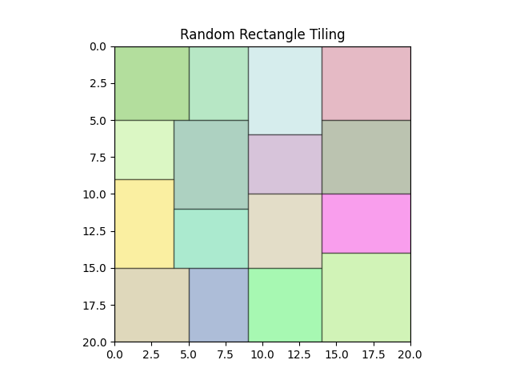

# RandTiling

[English](README.md) | [简体中文](README.zh-CN.md)

  
This project randomly divides a square (or rectangular) region into rows, then divides each row into smaller rectangles of random widths.

## Features

1. **Random Subdivision**  
   - A custom algorithm divides an interval of length `N` into `m` rows, then randomly divides each row into subintervals, ensuring that each block's width (or height) falls within `[lb, ub]`.

2. **Flexible Control**  
   - Adjust `lb` (lower bound) and `ub` (upper bound) to control the minimum and maximum width and height of each rectangle.  
   - The code includes assertions to prevent invalid subdivisions when the constraints cannot be satisfied.

3. **Visualization**  
   - **Matplotlib** plots the final random subdivision, displaying each randomly generated rectangle.


## Quick Start
1. **Clone or download this project**
   ```bash
    git clone https://github.com/shioko-chan/RandTiling.git
    cd RandTiling
   ```
2. **Install dependencies**
   ```bash
    python -m venv venv
    source venv/bin/activate  # Linux/macOS
    # Or venv\Scripts\activate  # Windows

    pip install -r requirements.txt
   ```
3. **Run the example**
   ```bash
    python randtiling.py
   ```

## Code Structure

- **`Block` class**  
  Describes a rectangle to be drawn, with coordinates `(x, y)` and dimensions `(w, h)`.

- **`Ceil` class**  
  Describes a subdividable interval `[start, end]` and its corresponding `height`.  
  - `split(length)`: splits off an interval of the specified length and updates the remaining interval.
  - `merge(other)`: merges adjacent intervals.
  - `as_block(bottom_height)`: converts the interval into a `Block` for plotting.

- **`split_ceil(...)`**  
  Randomly divides a total length `length` into `target_cnt` parts, each within `[lb, ub]`, and returns a list of their lengths.

- **`place_row(...)`**  
  Given the subdividable intervals `ceils`, the number of rows, the lower and upper bounds `lb, ub` for each block's width and height, and the number of blocks `cnt` to create, randomly generates a list of subdivided `Block` objects and the new remaining intervals.

- **`solve(N, m, lb, ub)`**  
  The main entry point: starts with the interval from x=0 to x=(N-1), divides it into `m` rows, and calls `place_row` to create blocks, ultimately returning a list of all `Block` objects.

- **`plot_solution(N, block)`**  
  Uses Matplotlib to display the resulting rectangles in an `N x N` coordinate system.

## Complexity Analysis

### 1. `split_ceil(lb, ub, target_cnt, length)`

- This function randomly divides a total length `length` into `target_cnt` parts, each within `[lb, ub]`.
- The main contributors to time complexity are:
  - Each allocation of the remaining length `leftover` in the `while` loop.
  - The loop that builds candidate indices for each allocation: `candidates = [i for i, x in enumerate(ans) if x < ub]`.

Let `tc` be the number of parts and `length` the total length:
- In the worst case, each iteration adds only one unit, so the number of iterations is proportional to `length`.
- Building the candidate indices in each iteration takes $O(\text{tc})$.

The overall complexity is approximately:
$$O(\text{length} \cdot \text{tc})$$

---

### 2. `place_row(H, lb, ub, cnt, row_cnt, row_id, ceils)`

- This function subdivides the given intervals `ceils` into rectangles and generates new intervals.
- Its time complexity mainly comes from the following operations:
  1. Iterating over `ceils` to compute the bounds and number of subdivisions for each interval. If there are $k$ intervals in `ceils`, this takes $O(k)$.
  2. Calling `split_ceil` for each interval. Assuming a total length of $L$ and $\text{cnt}$ blocks, the total complexity is $O(L \cdot \text{cnt})$.
  3. Sorting the subdivision results with `splitted_ceils.sort(...)`, which takes $O(k \log k)$.
  4. Merging rectangles, which takes $O(k)$.

Combining these gives:
$$O(L \cdot \text{cnt} + k \log k)$$

---

### 3. `solve(N, m, lb, ub)`

- The main function divides a square region of size $(N \times N)$ into $m$ rows.
- Its time complexity comes from calls to `place_row`:
  - `place_row` is called $m$ times. Each call subdivides intervals with a total length of at most $N$ and needs to create $m$ blocks.
- Assuming that the number of intervals $k$ in each row is approximately $m$:
  - One call to `place_row` has complexity $O(N \cdot m + m \log m)$.
  - The total complexity is:
$$O(m \cdot (N \cdot m + m \log m)) = O(m^2 N + m^2 \log m)$$

## TODO

The following features can still be improved or optimized:

- [ ] **Performance Optimization**  
   - Optimize the loops and random allocation logic in `split_ceil` and `place_row` to reduce time complexity.  
   - Introduce parallel processing or NumPy to accelerate large-scale random subdivision.  

- [ ] **Command-Line Support**  
   - Add command-line argument parsing (such as `argparse` support) so users can specify parameters such as `N`, `m`, `lb`, and `ub` from the command line.  

- [ ] **Unit Tests**  
   - Write unit tests for core functions such as `split_ceil`, `place_row`, and `solve` to verify correctness and boundary conditions.

Ideas and pull requests to improve this project are welcome!

## FAQ

1. **Why is plotting slow?**
   - When both N and m are large, the number of generated blocks can be very high, and plotting many rectangle patches with Matplotlib takes time. You can comment out parts of the plotting code or plot only smaller scenarios.

## Contributing and License

- This project is created and maintained by [shioko-chan](https://github.com/shioko-chan). Issues and pull requests are welcome.  

- This project is licensed under the [GNU Affero General Public License v3.0](https://www.gnu.org/licenses/agpl-3.0.html).  
  - This means you are free to use, modify, and distribute the project, but must retain the same open-source license when releasing modified versions. Any network service that interacts with this code must also make its source code available.

- If you have questions or suggestions for improvements, please open an issue in the repository.
